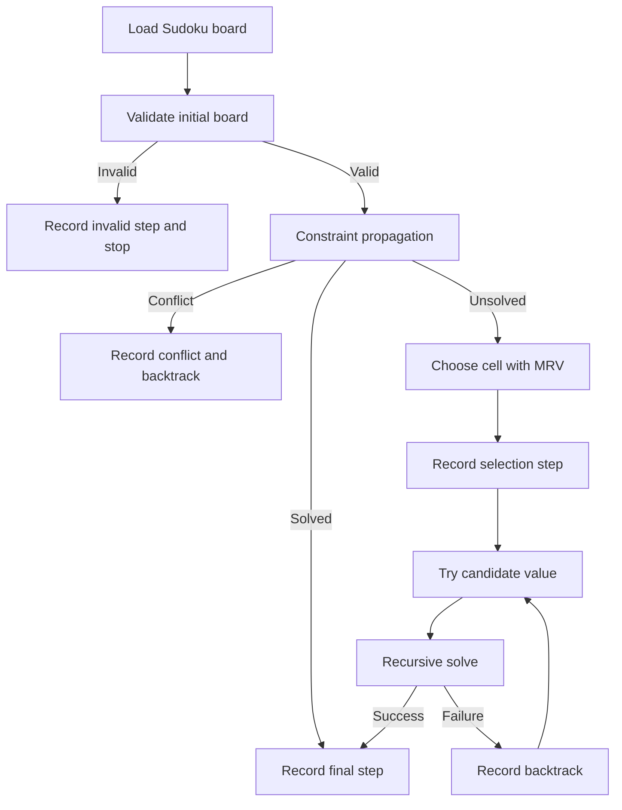

# Sudoku Solver Simulator

An interactive web application for demonstrating how a Sudoku puzzle is solved using a hybrid strategy based on:

- Constraint Propagation
- Minimum Remaining Values (MRV) heuristic
- Recursive Backtracking

The simulator is designed for academic presentation, technical demonstration, and classroom explanation. Instead of showing only the final solved board, it records the internal reasoning process as a sequence of structured simulation steps that can be replayed visually.

## Abstract

Sudoku solving is a classical constraint satisfaction problem. In this project, the 9x9 Sudoku board is treated as a search space in which each empty cell is a variable, each candidate digit is a potential domain value, and row, column, and 3x3 box rules act as constraints.

The simulator combines three complementary ideas:

- Constraint propagation reduces the search space by eliminating impossible values and filling forced cells.
- MRV selects the next most constrained empty cell, reducing branching factor.
- Backtracking performs depth-first exploration when deterministic propagation alone is insufficient.

This combination is both pedagogically useful and algorithmically effective, because users can observe how local deductions interact with global search.

## Objectives

- Build a fully local Sudoku solving simulator using React and Tailwind CSS.
- Explain the solver’s decision-making process step by step.
- Record each state transition in a structured format for playback.
- Visualize algorithmic events such as propagation, selection, guessing, and backtracking.
- Provide documentation suitable for academic submission and presentation.

## Key Features

- Editable 9x9 Sudoku input grid
- Predefined puzzles with different difficulty levels
- Candidate visualization inside empty cells
- Step-by-step simulation playback
- Previous, Next, Auto Play, Solve, and Reset controls
- Adjustable playback speed
- Explanation panel for each step
- Recursion depth display
- Backtrack counter
- Color-coded visualization:
  - Yellow for current active cell
  - Green for accepted placements
  - Red for rejected choices and backtracking

## Technology Stack

- React 18
- Vite
- Tailwind CSS
- Plain JavaScript solver implementation

## Project Structure

```text
src/
  components/
    Controls.jsx
    Grid.jsx
    StepViewer.jsx
  App.jsx
  solver.js
  utils.js
README.md
docs/
  technical-report.md
```

## How the Solver Works

The solver follows a three-stage strategy:

1. Constraint propagation
2. MRV-based variable selection
3. Recursive backtracking search

### 1. Constraint Propagation

For each empty cell, the solver computes the set of allowed values by checking:

- Values already used in the same row
- Values already used in the same column
- Values already used in the same 3x3 subgrid

If only one candidate remains, that value is forced and is placed immediately.

This process repeats until:

- no more forced moves exist, or
- a contradiction appears because a cell has zero candidates

### 2. MRV Heuristic

When propagation cannot solve the next cell deterministically, the solver chooses the empty cell with the fewest candidates.

This is the Minimum Remaining Values heuristic.

Why this helps:

- it chooses the most constrained variable first
- it often exposes contradictions earlier
- it reduces unnecessary branching

### 3. Backtracking

If multiple candidates remain for the MRV-selected cell, the solver:

- tries one candidate
- recursively continues solving
- backtracks if the guess eventually causes a contradiction

This creates a depth-first recursion tree.

## Solver Pipeline Diagram



## Step Recording Model

The simulator stores every important state transition in a structured object.

```js
{
  row,
  col,
  candidates,
  chosen_value,
  action,       // "try" | "backtrack" | "final"
  stage,        // "start" | "propagate" | "select" | "guess" | "reject" | ...
  board_state,
  explanation,
  depth,
  backtrack_count
}
```

### Meaning of Important Fields

- `row`, `col`: the active cell coordinates
- `candidates`: current legal values for the cell
- `chosen_value`: the value selected for trial or forced placement
- `action`: broad simulation category
- `stage`: finer-grained internal phase
- `board_state`: a deep copy of the board at that exact step
- `explanation`: human-readable narration for the UI
- `depth`: recursion depth of the current search call
- `backtrack_count`: cumulative number of backtrack events

## Simulation and Visualization

The playback system uses the recorded `steps` array as the single source of truth for animation and explanation.

### Playback Logic

- `Solve` generates the full step sequence using `solveSudokuWithSteps()`
- `Next Step` advances the simulation index
- `Previous Step` moves backward through prior states
- `Auto Play` increments the current step on a timer
- `Reset` restores the selected puzzle and clears generated steps

### Visualization Mapping

- Current active cell is highlighted in yellow
- Successful guess or propagation step is highlighted in green
- Backtracking step is highlighted in red
- Empty cells display candidate digits in miniature form
- The explanation panel shows the textual meaning of the active state

## Core Functions

### `getCandidates(board, row, col)`

Computes the legal domain for a specific empty cell by excluding values seen in:

- the same row
- the same column
- the same 3x3 box

### `constraintPropagation(board, recordStep, depth)`

Repeatedly scans the grid and fills cells having exactly one valid candidate.

It stops when:

- the board reaches a fixed point with no further forced moves, or
- a contradiction is detected

### `findBestCell(board)`

Implements MRV by returning the empty cell with the smallest candidate list.

### `solveSudokuWithSteps(initialBoard)`

Entry point for the full solving pipeline. It:

- clones the input board
- validates the puzzle
- creates the simulation recorder
- launches recursive solving
- returns the solved board, full step history, backtrack count, and any error

## Example of Constraint Propagation

Suppose the current board has the following partial row:

```text
[5, 3, 0, 0, 7, 0, 0, 0, 0]
```

Assume we inspect cell `(1,3)`:

- row excludes: `5, 3, 7`
- column excludes: values already present in column 3
- box excludes: values already present in the top-left 3x3 subgrid

If all digits except `4` are eliminated, then:

```text
candidates(1,3) = {4}
```

So the placement is forced and is recorded as a propagation step.

## Example of MRV

Assume three empty cells have the following candidate sets:

```text
Cell A -> {2, 5, 7}
Cell B -> {4}
Cell C -> {1, 6}
```

MRV chooses `Cell B` first because it has the smallest domain.

If propagation already handled all singletons, then among remaining unsolved cells MRV would choose `Cell C` before `Cell A`.

## Example of Backtracking

Assume the solver reaches a cell with:

```text
candidates = {2, 8}
```

The solver tries `2` first.

If later propagation creates a contradiction, the solver:

- records a conflict
- returns from recursion
- records a reject/backtrack event
- tries `8` instead

This demonstrates systematic depth-first exploration.

## Recursion Tree Illustration

```text
Root
└── Select cell (r,c) with candidates {2,8}
    ├── Try 2
    │   ├── Propagate forced moves
    │   └── Conflict detected
    │       └── Backtrack
    └── Try 8
        ├── Propagate forced moves
        ├── Select next MRV cell
        └── Continue until solved
```

## Time Complexity Analysis

Sudoku solving with backtracking is exponential in the worst case.

### Candidate Computation

For one cell, checking row, column, and box is constant with respect to puzzle size because Sudoku is fixed at 9x9.

So in this implementation:

- `getCandidates()` is effectively `O(1)` for standard Sudoku

### Constraint Propagation

The solver may scan all 81 cells repeatedly until no changes occur.

For standard Sudoku:

- each scan is bounded
- the overall cost remains small in practice

In generalized `n x n` Sudoku notation, propagation is polynomial per iteration but repeated until fixed point.

### Backtracking

Worst-case complexity is exponential:

```text
O(b^d)
```

Where:

- `b` is the branching factor, i.e. average number of candidates tried
- `d` is the recursion depth, i.e. number of unresolved decision points

### Why the Combined Strategy Is Faster in Practice

- Constraint propagation shrinks domains before guessing
- MRV lowers the effective branching factor
- Early contradiction detection reduces wasted search

Therefore, while the theoretical worst case remains exponential, practical runtime is significantly improved.

## Space Complexity

The main space costs are:

- recursion stack
- stored board snapshots inside `steps`
- cloned boards used during search

If `s` simulation steps are recorded, total memory is roughly proportional to:

```text
O(s * 81)
```

because each step stores a full board snapshot.

This is intentional because deterministic replay is more important here than memory minimization.

## Academic Relevance

This project is suitable for:

- Design and analysis of algorithms coursework
- Constraint satisfaction problem demonstrations
- AI search and heuristics presentations
- Educational software prototypes
- Interactive academic posters or demos

## Running the Project

### Install dependencies

```bash
npm install
```

### Start the development server

```bash
npm run dev
```

### Build for production

```bash
npm run build
```

### Preview production build

```bash
npm run preview
```

## Build Status

The application has been verified with a successful production build using:

```bash
npm run build
```

## Additional Report

A longer report-style technical document is available in:

[docs/technical-report.md](</c:/Users/Milin/Desktop/WEB Dev/suduko-solver/docs/technical-report.md>)
