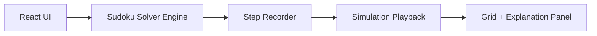
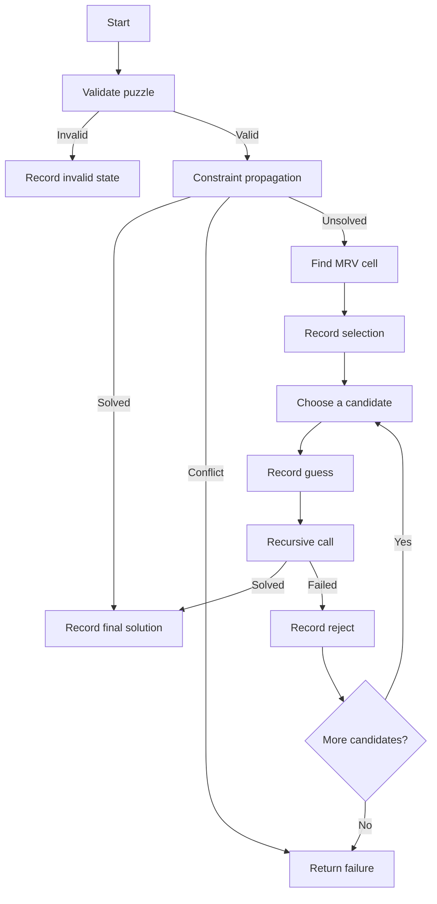

# Technical Report
## Sudoku Solver Simulator Using Constraint Propagation, MRV, and Backtracking

## 1. Introduction

Sudoku is a well-known combinatorial puzzle that can be modeled as a constraint satisfaction problem (CSP). The goal is to fill a 9x9 grid with digits from 1 to 9 such that:

- each row contains each digit exactly once
- each column contains each digit exactly once
- each 3x3 subgrid contains each digit exactly once

The purpose of this project is not only to solve Sudoku puzzles, but to expose the internal reasoning of the solver as an interactive simulation. This makes the system useful for academic explanation, algorithm analysis, and live presentations.

## 2. Problem Formulation

The Sudoku board is represented as a matrix:

```text
Board = 9 x 9 grid
```

Each empty cell is a variable, and the domain of that variable is:

```text
{1, 2, 3, 4, 5, 6, 7, 8, 9}
```

The constraints are:

- no repetition in row
- no repetition in column
- no repetition in box

Thus, Sudoku can be written as:

```text
Find assignment A such that all variables are assigned
and all row, column, and subgrid constraints are satisfied.
```

## 3. Solver Architecture

The solving engine is implemented in `src/solver.js` and is structured around four main functions:

- `getCandidates()`
- `constraintPropagation()`
- `findBestCell()`
- `solveSudokuWithSteps()`

### 3.1 High-Level Architecture



The architecture separates:

- algorithm logic
- simulation state recording
- UI playback and explanation

This separation improves clarity and makes the project suitable for both demonstration and study.

## 4. Algorithm Workflow

The solver executes the following cycle:

1. Validate board
2. Apply constraint propagation
3. If solved, stop
4. Otherwise choose an MRV cell
5. Try one candidate
6. Recurse
7. If contradiction occurs, backtrack

### 4.1 Full Control Flow



## 5. Constraint Propagation

Constraint propagation reduces the domain of each empty cell based on the existing assignments.

### 5.1 Candidate Elimination Rule

For an empty cell `(r, c)`, the candidate set is:

```text
Candidates(r, c) =
{1..9} - RowUsed(r) - ColUsed(c) - BoxUsed(r, c)
```

### 5.2 Example

Assume the current top-left 3x3 region is:

```text
5 3 0
6 0 0
0 9 8
```

For cell `(1,3)`:

- row already contains `5, 3, 7`
- column already contains some additional values
- subgrid already contains `5, 3, 6, 9, 8`

After elimination, if only `{4}` remains, then:

```text
Cell (1,3) = 4
```

This is a forced move and is recorded as a propagation event.

### 5.3 Why It Matters

Constraint propagation:

- reduces the search space early
- avoids unnecessary guessing
- detects contradictions quickly

## 6. MRV Heuristic

The MRV heuristic chooses the unfilled variable with the smallest legal domain.

### 6.1 Formal Idea

If:

```text
|Candidates(x)| < |Candidates(y)|
```

then `x` is preferred before `y`.

### 6.2 Example

Suppose the board contains these unresolved cells:

```text
(2,3) -> {5, 6}
(4,8) -> {1, 3, 4, 9}
(7,5) -> {2}
```

Then MRV chooses `(7,5)` first.

If single-candidate cells were already solved by propagation, then the next smallest domain would be selected.

### 6.3 Motivation

MRV is useful because the most constrained variable is often the most informative one.

Benefits:

- smaller branching factor
- earlier failure detection
- less wasted recursion

## 7. Backtracking Search

Backtracking handles the cases where propagation cannot decide uniquely.

### 7.1 Method

For an MRV-selected cell:

1. choose one candidate
2. assign it temporarily
3. recursively solve the reduced board
4. if contradiction appears, undo and try the next candidate

### 7.2 Recursion Tree Example

```text
Depth 0: select (4,4) -> {2, 8}
├── Try 2
│   ├── Propagation
│   ├── Select next cell
│   └── Conflict
│       └── Backtrack
└── Try 8
    ├── Propagation
    ├── More recursion
    └── Solved
```

### 7.3 Why Backtracking Is Still Needed

Sudoku often contains states where no deterministic move exists. In such cases:

- propagation alone is insufficient
- heuristic ordering helps but cannot fully solve
- systematic search is required

Backtracking provides completeness, meaning if a valid solution exists, the algorithm can find it.

## 8. Step Generation and Simulation

One of the most important features of this project is that every significant internal decision is recorded.

### 8.1 Recorded Events

The solver records:

- initial load
- propagation placements
- MRV selection
- candidate guesses
- conflict detection
- reject/backtrack events
- final solved state

### 8.2 Step Object

```js
{
  row,
  col,
  candidates,
  chosen_value,
  action,
  stage,
  board_state,
  explanation,
  depth,
  backtrack_count
}
```

### 8.3 Why Full Board Snapshots Are Stored

The application stores the full board for each step rather than reconstructing states later.

Advantages:

- deterministic playback
- easier previous/next navigation
- simpler UI logic
- clearer academic demonstration

Tradeoff:

- higher memory usage

This is acceptable because the project prioritizes interpretability over memory efficiency.

## 9. Visualization Design

The visualization layer maps algorithmic events to visual signals.

### 9.1 Color Semantics

- Yellow: active cell under analysis
- Green: successful forced placement or accepted trial
- Red: contradiction or rejected guess

### 9.2 Candidate Rendering

Empty cells display candidate digits as a 3x3 miniature grid, allowing users to see the local domain of a variable directly.

### 9.3 Explanation Panel

For each recorded step, the UI displays:

- current cell coordinates
- candidate list
- chosen value
- action and stage
- recursion depth
- human-readable explanation

This makes the simulator useful not only for solving but for teaching.

## 10. Complexity Analysis

### 10.1 Worst-Case Time Complexity

Sudoku solving by backtracking is exponential in the number of decision points:

```text
O(b^d)
```

Where:

- `b` is the branching factor
- `d` is the depth of recursive choices

### 10.2 Candidate Computation Cost

For standard Sudoku:

- row scan: constant bounded
- column scan: constant bounded
- box scan: constant bounded

So `getCandidates()` is effectively `O(1)` for a fixed 9x9 board.

### 10.3 Practical Performance

In practice, performance is much better than raw worst-case search because:

- propagation shrinks the state space
- MRV reduces branching
- contradictions are detected early

### 10.4 Space Complexity

Space complexity includes:

- recursion stack
- cloned board states
- recorded simulation snapshots

If `s` is the number of steps:

```text
O(s * 81)
```

since each step stores a full board snapshot of 81 entries.

## 11. Design Rationale

This project intentionally favors explainability.

### 11.1 Why Not Use a More Aggressive Solver?

More advanced strategies exist, such as:

- naked pairs
- hidden pairs
- X-Wing
- dancing links

However, the chosen combination of propagation, MRV, and backtracking is preferable for this project because it is:

- easier to explain
- widely recognized in AI and algorithm courses
- sufficient for a strong educational demo

### 11.2 Why Step-Based Recording?

Because the goal is simulation, not only performance.

The recorded trace allows:

- playback
- explanation
- visual narration
- reproducibility

## 12. Suitability for Academic Submission

This project is appropriate for:

- algorithm design reports
- AI search strategy demonstrations
- CSP modeling assignments
- HCI demonstrations of algorithm visualization
- interactive research or teaching prototypes

It demonstrates both implementation skill and algorithmic understanding.

## 13. Conclusion

The Sudoku Solver Simulator provides an educational implementation of a classic constraint satisfaction workflow. By combining:

- constraint propagation for deterministic deductions
- MRV for informed variable ordering
- backtracking for complete search

the system solves Sudoku puzzles while exposing every meaningful reasoning step to the user.

This makes the project more than a solver. It becomes a teaching tool, an algorithm visualizer, and a presentation-ready academic artifact.

## 14. Suggested Presentation Talking Points

For oral presentation or slides, the following sequence works well:

1. Introduce Sudoku as a CSP
2. Explain candidate generation
3. Show one propagation example
4. Explain MRV with a simple table of candidate counts
5. Show a small recursion tree for backtracking
6. Demonstrate the simulator playback
7. Conclude with complexity and educational value
